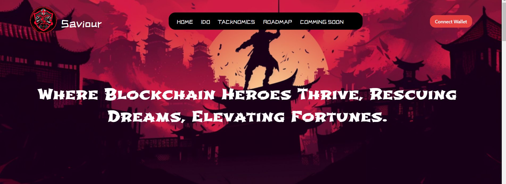
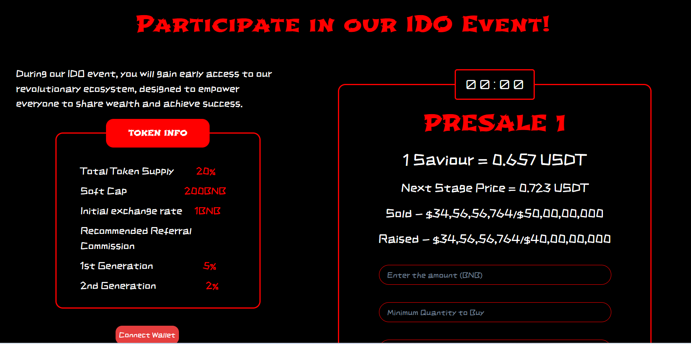

# Figma Project

Welcome to the Saviour Project! This project is built using React and Chakra UI to create a modern, responsive user interface for a blockchain-based application. The application features various sections, including an introduction, IDO event participation, tokenomics, and a roadmap.

# Tech stack

1. React
2. Chakra UI

## Deplolyed App

Frontend: https://figma-design-pf4i.vercel.app/ <br>


# Folder Structure

Figma-Design
├── public/
│ ├── vite.svg
│  
│  
├── src/
│ ├── assets/
│ │ ├── images/
│ │ │ └── logo.png
│ │ └── styles/
│ │ └── global.css
│ ├── components/
│ │ ├── 1stPart.jsx
│ │ ├── 2ndPart.jsx
│ │ ├── 3rdPart.jsx
│ │ ├── 4thPart.jsx
│ │ ├── 5thPart.jsx
│ │ ├── 6thPart.jsx
│ │ └──7thPart.jsx
│ │  
│ │  
│ │  
│ ├── App.css
│ │  
│ ├── App.jsx
│  
│ ├── figma.jsx
│ │  
│ │  
│ ├─index.jsx
│ ├── main.jsx
│ └
├── .gitignore
├── package.json
├── README.md
└── vit.config.js

## Installation & Getting started

```bash
clone the repo
cd into figma_design
npm install
```
#### Pictures




